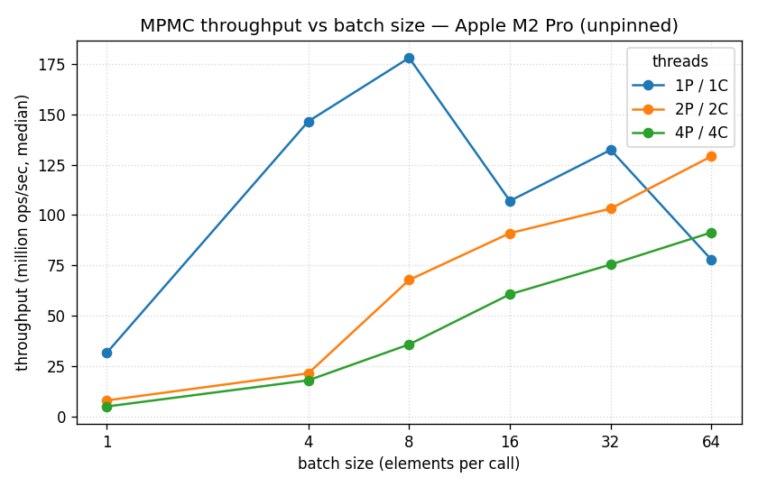

# ring-buffer

[](https://github.com/sohipan21/ring-buffer/actions/workflows/ci.yml)

A bounded multi-producer / multi-consumer ring buffer in C++20 — header-only, no
dependencies. `try_push` / `try_pop` don't lock and don't wait; they return false
when the queue is full or empty. It uses Vyukov's sequence-number protocol with CAS
slot claiming, and batch push/pop move a run of elements under a single atomic. It's
lockless but not formally lock-free — the [design notes](DESIGN.md) cover the
difference and the rest of the reasoning. v1 handles trivially copyable types and
power-of-two capacities.

```cpp
#include <ringbuffer/mpmc_ring_buffer.hpp>

ringbuffer::MpmcRingBuffer<int, 1024> queue;
if (queue.try_push(42)) { /* ... */ }
int value;
if (queue.try_pop(value)) { /* ... */ }
```

## Results

Measured on an Apple M2 Pro (6 performance + 4 efficiency cores), threads unpinned on
an active machine, so treat them as directional. The numbers come from the CSVs in
[`results/`](results/2026-07-24-Sohams-MBP-4); reproduce with `scripts/run_benchmarks.sh`.

Throughput (median million ops/sec):

| Config | this queue | `std::mutex`+deque | moodycamel | SPSC |
|---|--:|--:|--:|--:|
| 1P/1C, single | 31.6 | 16.0 | 47.7 | 40.0 |
| 4P/4C, single | 5.0 | 16.4 | 8.6 | — |
| 4P/4C, batch 64 | 91.4 | 62.0 | 104.7 | — |

Round-trip latency (nanoseconds):

| Queue | p50 | p99 | p99.9 | max |
|---|--:|--:|--:|--:|
| this queue | 169 | 622 | 708 | 42,542 |
| `std::mutex`+deque | 2,714 | 28,157 | 189,422 | 1,604,584 |
| moodycamel | 210 | 959 | 4,185 | 57,875 |



Batching is where the throughput comes from — at 4P/4C, one CAS spread over the batch
takes it from 5M to 91M ops/sec. On latency the median beats the mutex queue ~16×, but
the tail is the bigger gap: ~700 ns at p99.9 versus ~190 µs (1.6 ms worst case), since
a stalled lock blocks everyone while a stalled slot only blocks its own consumer.
moodycamel is quicker at single ops but unbounded, so under saturation it climbs to
~6 ms end-to-end while this queue holds near 60 µs.

It's not a clean sweep: at 4P/4C single ops the mutex (16M) is ahead of this queue
(5M), because eight threads oversubscribe six performance cores and a thread parked
mid-claim stalls its consumer. At 1P/1C it's ~2× faster. macOS can't pin threads, so a
pinned Linux run is the fair contention test. More in
[DESIGN.md](DESIGN.md#12-reading-the-numbers).

## Build & test

```sh
cmake -B build -DCMAKE_BUILD_TYPE=Release
cmake --build build
ctest --test-dir build --output-on-failure
```

Requires CMake ≥ 3.20 and a C++20 compiler. CI covers clang and gcc, with
ThreadSanitizer and ASan+UBSan builds.

## Benchmarks

```sh
scripts/run_benchmarks.sh
```

Builds with `-DRINGBUFFER_BUILD_BENCH=ON -DRINGBUFFER_FETCH_BASELINES=ON` (the latter
fetches moodycamel for comparison — bench-only, never a dependency of the library),
captures machine specs, and runs the throughput and latency suites into `results/`.

## Design

Each slot carries an atomic sequence number that says whether it's free and which lap
it's on — that's what handles ABA. Producers and consumers claim positions with a CAS
loop rather than `fetch_add`, so a full or empty queue fails cleanly instead of
blocking, and batch operations claim a contiguous run under one CAS. The position
counters and each slot sit on separate cache lines to avoid false sharing.
[DESIGN.md](DESIGN.md) walks through the protocol, the progress-guarantee argument, and
the memory-order audit.
